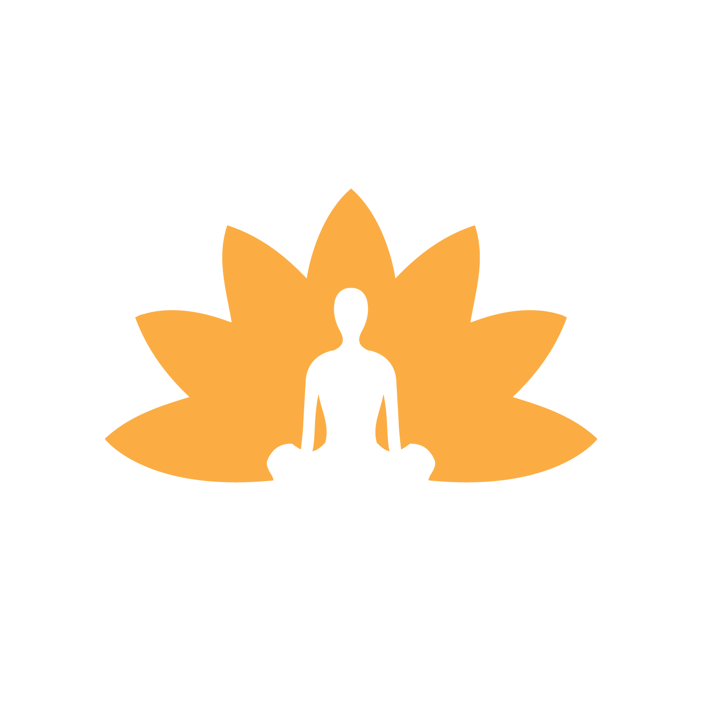
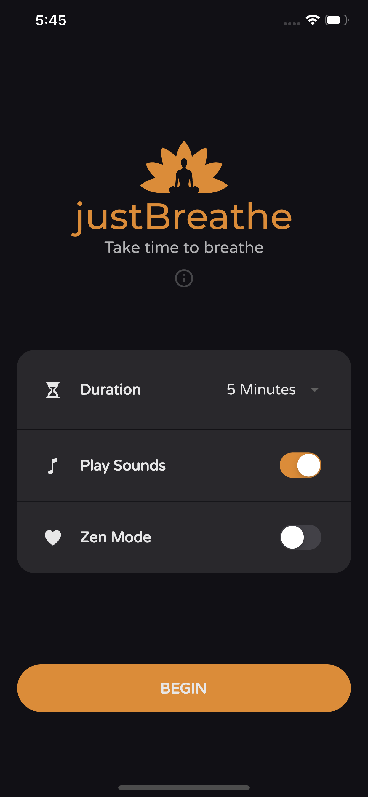
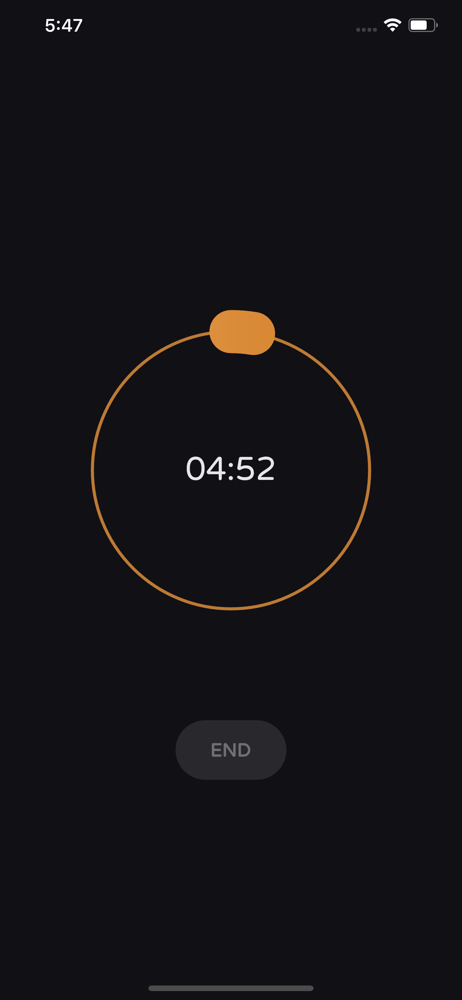
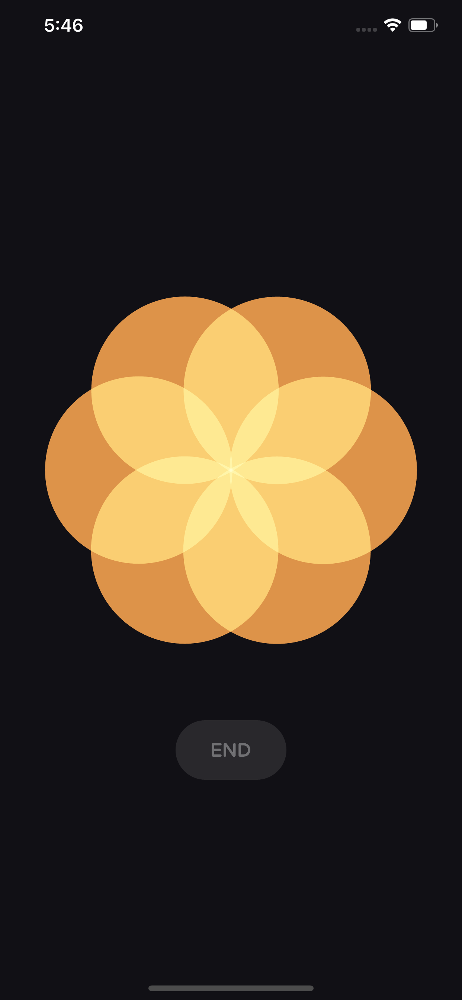
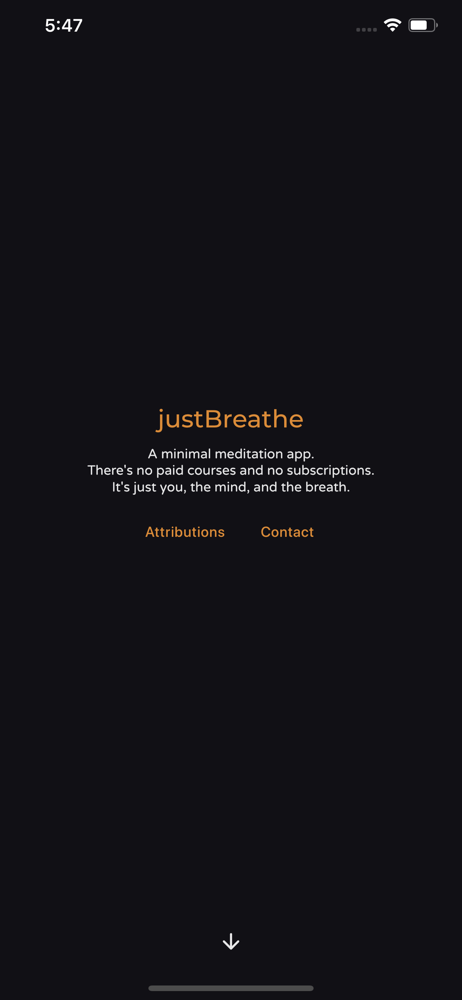

<h1 align="center">
    justBreathe
     
     
</h1>

A minimal meditation app. 
There's no paid courses and no subscriptions.
It's just you, the mind, and the breath.
 

[Official Website](https://justbreathe.lising.ca)

# Features

- 💙 Built with Flutter.
- A simple meditation app without the frills
- Free (as in free beer and FOSS).
- No tracking
- Automatic Dark Mode
- _Zen Mode_ - display a beautiful breathing animation inspired by Apple
- French language supported! (And more to come!)

# Screenshots

     
     
     
     

# Roadmap to Production

- [x] French Localization
- [x] Release the app on the Play Store! (PROD)
- [ ] Release the app on the App Store! (PROD)

# Future
- [ ] Basic testing
- [ ] Add more localizations: Swedish
- [ ] Add breathing techniques: box, wim-hof, etc...
